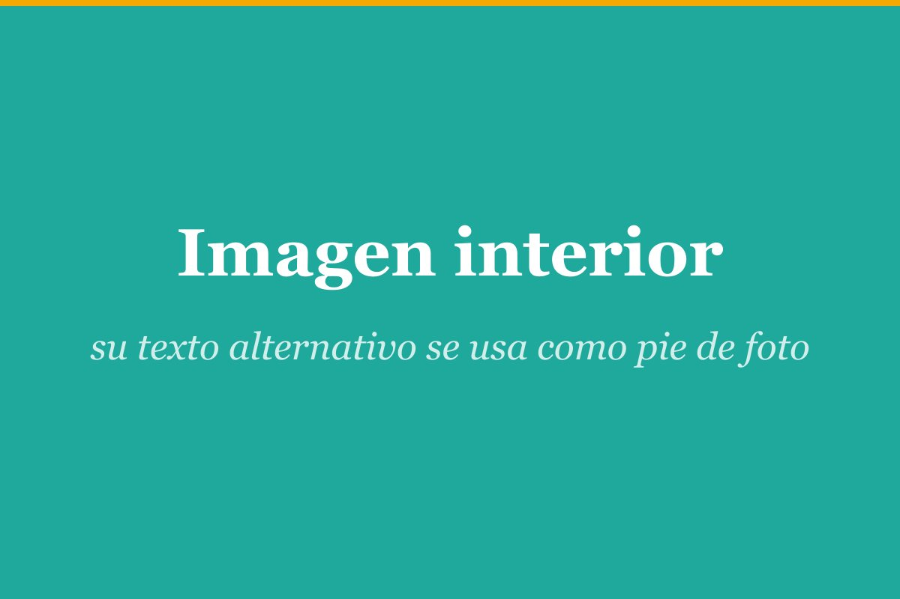

Este es el cuerpo del artículo en **Markdown**. Puedes usar todo lo habitual: listas,
tablas, enlaces, énfasis, etc.

## Una imagen con pie de foto

El texto alternativo se convierte en el pie de foto:

## Un vídeo embebido

Usa el shortcode `::video` en su propia línea:

::video https://www.youtube.com/watch?v=dQw4w9WgXcQ | Un vídeo de ejemplo

## Listo

Guarda esta carpeta, ejecuta `ghost-publish --dry-run ./` para revisar el payload y,
si todo cuadra, `ghost-publish ./` para crear el draft en Ghost.
